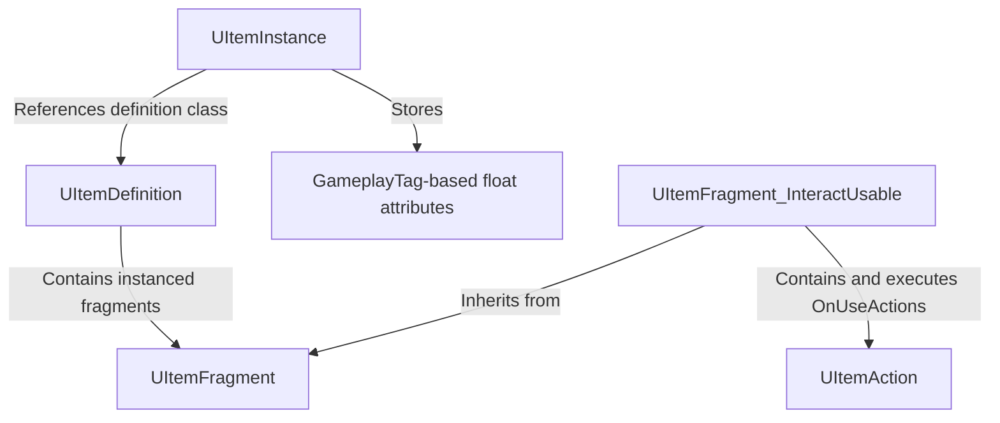

# ItemDefinitionKit

A data-driven item definition plugin for Unreal Engine 5 with Blueprint and C++ support. Item data and behavior are organized through composable fragments, reusable actions, and runtime instances.

## Requirements

- Unreal Engine 5.0+
- Visual Studio
- Module dependencies: `Core`, `CoreUObject`, `Engine`, `GameplayTags`, `Slate`, `SlateCore`

## Core Features

- **Item definitions** (`UItemDefinition`): item names, descriptions, and fragment collections. The definition structure and fields can be modified or extended to match project requirements.
- **Fragments** (`UItemFragment`): modular item data and behavior, with initialization hooks for runtime instances.
- **Actions** (`UItemAction`): reusable behaviors with Blueprint and C++ extension support.
- **Runtime instances** (`UItemInstance`): definition references and GameplayTag-based numeric attributes.
- **Blueprint utilities**: instance creation, attribute access, and fragment lookup.

## Structure

Definitions hold shared item data and fragment configuration. Runtime instances hold per-instance attributes. Interaction fragments group reusable actions for item use.

## Built-in Fragments and Actions

### Fragments

Fragments (`UItemFragment`) are modular data or behavior objects embedded in item definitions. The `OnInstanceCreated` hook supports initialization logic for runtime instances.

| Built-in fragment              | Description                                                                                                                                 |
| ------------------------------ | ------------------------------------------------------------------------------------------------------------------------------------------- |
| `UItemFragment_StaticMesh`     | Stores a static mesh reference for item visuals.                                                                                            |
| `UItemFragment_SkeletalMesh`   | Stores a skeletal mesh reference and animation settings, including an animation mode, animation instance class, or animation asset.         |
| `UItemFragment_InteractUsable` | Stores an `OnUseActions` list and executes the configured actions through `InteractUse`. Returns success when at least one action succeeds. |

### Actions

Actions (`UItemAction`) are reusable behavior objects executed through `Execute`, with an item owner and runtime instance as context. Custom behavior can be implemented in Blueprint or C++.

| Built-in action                   | Description                                                                                                                       |
| --------------------------------- | --------------------------------------------------------------------------------------------------------------------------------- |
| `UItemAction_PlaySound2D`         | Plays a 2D sound with configurable volume, pitch, and start time.                                                                 |
| `UItemAction_PlaySoundAtLocation` | Plays a sound at a configured world location and rotation, with volume, pitch, start time, attenuation, and concurrency settings. |
